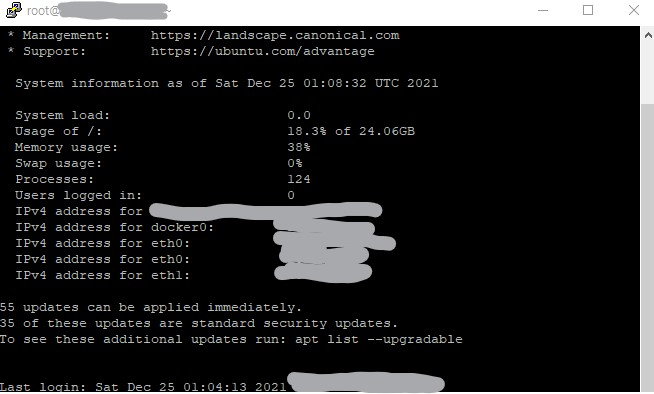

Droplets are scalable Linux-based virtual machines from [DigitalOcean](https://www.digitalocean.com).
We will take a look at how to create a Droplet, running Ubuntu 20.04 (LTS) x64.

### Create a Droplet

After registering an account with [DigitalOcean](https://www.digitalocean.com), create a new project, which will run on the droplet we are about to create.


Next, click on Create, then select Droplet.


We will select Ubuntu as an image, and select the remaining options suitable for our needs.


For Authentication, we will select SSH keys. Since I'm running Windows on my PC, I will be using [PuTTygen](https://www.puttygen.com/) to generate public and private SSH keys and [PuTTy](https://www.putty.org/) to access our Droplet. Those who use Mac or Linux can just use ssh-keygen to generate SSH keys and ssh into their droplet.

Open PuTTygen and click on "Generate".


First, click on "Save public key" and "Save private key" to save both keys to a file. We will use the public key file later.

On DigitalOcean's Droplet setup page, click on "New SSH Key". Copy the generated key on PuTTYgen and paste it into the SSH key content. Enter a name and click "Add SSH Key".


We can enter a hostname and then select our project we had created in the beginning, then click "Create Droplet".


And we have our new Droplet! We can access our Droplet with PuTTy or SSH.


### Connect to a Droplet

1. Copy the ipv4 address of our droplet.
2. Open PuTTy and paste the ip address into Host Name.
   
3. Under SSH -> Auth, click "Browse" and choose the private key file we saved from PuTTygen earlier.
   
4. Go back to Session and click "Open".
5. Login as "root"
   

We are connected to our Droplet as "root".



Now, instead of continuing as "root", it's better to create a new user for security reasons. So let's create a new user.

#### Add a new user

Follow the following steps to create a new user.

1. Use the adduser command to create a new user.

```
$ adduser username
```

2. Set the password at the prompt.
3. Follow the prompts to set the new user's information.
4. Use the `usermod` command to add the user to the "sudo" group

```
$ usermod -aG sudo username
```

5. Use the `su - username` command to switch to the new user.

```
$ su - username
```

We are now switched into our new user.

### Conclusion

We created a new project and Droplet in DigitalOcean.
We will create a server on our Droplet in the next post.
