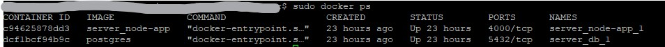

Using Docker, let's spin up a Node.js app and Postgresql DB containers and deploy them on the Droplet we created in the last [post](/2021-12-24-digitalocean-droplet/).

### Install Docker

Connect to the Droplet via SSH or PuTTy and follow the instructions on the [Docker](https://docs.docker.com/engine/install/ubuntu/) and [Docker Compose](https://docs.docker.com/compose/install/) documentation pages to install Docker and Docker Compose on Ubuntu.

### Dockerfile

Let's create a Dockerfile to install Node.js. We will also specify all files (code, configs, assets, etc) to copy into the container, which we will generate in a moment.

_Dockerfile_

```
FROM node:latest
WORKDIR /app
COPY package.json .
RUN npm install
COPY . .
RUN npx prisma generate
EXPOSE 4000
CMD ["npm", "run", "start"]
```

If we are using [Prisma](https://www.prisma.io/) in our app, we should also let Docker run the `prisma generate` command during build.

### .dockerignore

Before we continue, let's create a .dockerignore file to exclude certain files when Docker runs the `Copy` command in the Dockerfile we created earlier.

_dockerignore_

```
node_modules
Dockerfile
.env
.dockerignore
.git
.gitignore
```

### docker-compose.yml

We will create three different docker-compose.yml files to configure our application's dependencies in development and production environment.

Let's start with the main docker-compose file, which includes the configuration for our Node app as well as for the Postgresql image we will use from [DockerHub](https://hub.docker.com/_/postgres).

_docker-compose.yml_

```
version: '3'
services:
  node-app:
    build: .
    volumes:
      - ./:/app
      - /app/node_modules
    environment:
      - PORT=4000
    depends_on:
      - db
  db:
    image: postgres
    restart: always
    environment:
      - POSTGRES_PASSWORD=${POSTGRES_PASSWORD}
      - POSTGRES_USER=${POSTGRES_USER}
    volumes:
      - postgres:/var/lib/postgresql/data
volumes:
  postgres:
```

Next, we will create _docker-compose.dev.yml_ and _docker-compose.prod.yml_ to configure the development and production environment, respectively

_docker-compose.dev.yml_

```
version: '3'
services:
  node-app:
    environment:
      - NODE_ENV=development
      - DATABASE_URL=${DATABASE_URL_DEV}
    command: npm run start
```

_docker-compose.prod.yml_

```
version: '3'
services:
  node-app:
    environment:
      - NODE_ENV=production
      - DATABASE_URL=${DATABASE_URL_DIGITALOCEAN}
    command: >
      sh -c "npm run db:migrate:prod &&
             npm run build &&
             npm run start:prod"
```

### Build Images, Create and Start Containers

We can use the `docker-compose up` command to build images and create containers, then start them all at once. We can also specify .env file with the `--env-file` flag, followed by the path to the .env file.

To do this for a development environment, we run the following:

```
docker-compose -f docker-compose.yml -f docker-compose.dev.yml --env-file ./.env up -d
```

Or the following for a production environment:

```
docker-compose -f docker-compose.yml -f docker-compose.prod.yml --env-file ./.env up -d
```

We should now have two containers running for our Node app and Postgresql DB.



### Conclusion

We have deployed a Node app and Postgresql DB to our Droplet with Docker and they are running on the Docker containers we created.

In the next post, we will add Nginx Web Server to our Droplet to direct traffic to our server via reverse-proxy.
