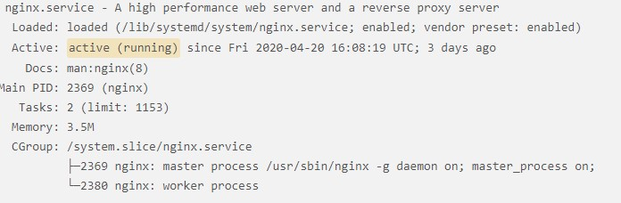

Our Node app is running on the Docker container we created in the last [post](http://localhost:8000/2021-12-25-nodejs-postgresql-server-digitalocean/).

Let's add an Nginx Web Server to our Droplet, so that we can reverse-proxy all traffic to our server.

### Install Nginx

We can connect to our Droplet and install Nginx with the following command:

```
$ apt install nginx
```

When the installation is completed, verify that Nginx is running by typing:

```
$ systemctl status nginx
```

And we should get something similar to:



### Server Blocks

We can set up server blocks to set different configurations and host more than one domain from a single server.

For this, we can create new config files (i.e., /etc/nginx/sites-available/your_domain) for our domain or we can use the default file (/etc/nginx/sites-available/default).

We will just modify the default file. So modify it as follows:

```
server {
  server_name your_domain www.your_domain;

  location / {
    proxy_pass http://your_domain:port;
  }
}

```

**NOTE: If you are creating your own files for your domain, make sure you link them to the _/etc/nginx/site-enabled_ directory with the following command:**

**`$ ln -s /etc/nginx/sites-available/your_domain /etc/nginx/sites-enabled/`**

Test to make sure there's no syntax error in the files by typing:

```
$ nginx -t
```

If everything is good, restart Nginx:

```
$ systemctl restart nginx
```

That's it! Nginx is now running on our Droplet, and it will direct traffic to our domain, where our Node app is running.

### Conclusion

We set up Nginx Web Server on our Droplet. In the next post, we will set up SSL with Let's Encrypt.
